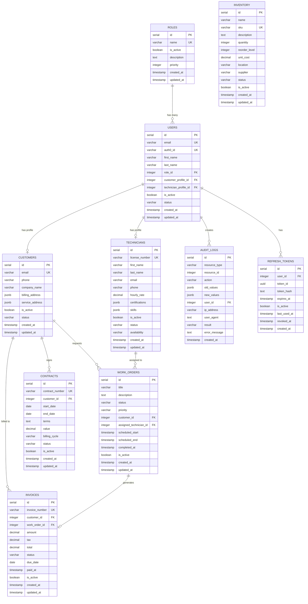

# Entity Relationship Diagram (ERD)

Database schema relationships for Tross.

## Visual ERD

## Entity Categories

### Business Entities

Core domain entities following Entity Contract v2.0:

- **USERS** - System users with authentication
- **CUSTOMERS** - Service recipients
- **TECHNICIANS** - Service providers
- **WORK_ORDERS** - Service requests
- **INVOICES** - Billing records
- **CONTRACTS** - Service agreements
- **INVENTORY** - Stock management

### Reference Entities

Configuration and lookup data:

- **ROLES** - Permission groupings

### System Entities

Internal system tables:

- **AUDIT_LOGS** - Change tracking
- **REFRESH_TOKENS** - Session management

## Relationship Patterns

### User-Profile Pattern

Users can have optional profile associations:

- User → Customer (customer portal access)
- User → Technician (field service access)

This enables role-based views of the same underlying user.

### Ownership Pattern

Business entities reference their owner for RLS:

- Work orders → Customer (requester)
- Work orders → Technician (assignee)
- Invoices → Customer (billable party)

### Audit Pattern

All modifications tracked:

- Resource type + ID identifies the changed entity
- Old/new values capture the delta
- User ID tracks who made the change

## Entity Contract

See [DATABASE_ARCHITECTURE.md](DATABASE_ARCHITECTURE.md) for full contract details.

**Key Points:**

- All business entities have `id`, identity field, `is_active`, timestamps
- Workflow entities add `status` field
- Status values defined in entity metadata files

## See Also

- [Database Architecture](DATABASE_ARCHITECTURE.md) - Entity Contract v2.0
- [Entity Lifecycle](ENTITY_LIFECYCLE.md) - Status field patterns
