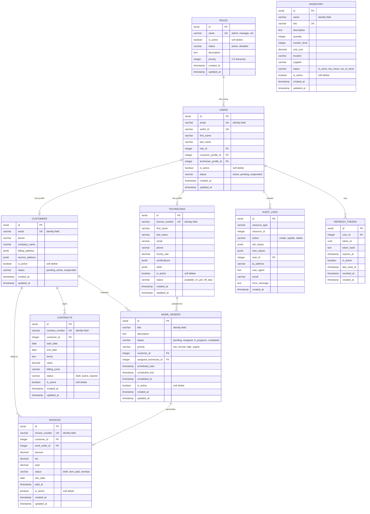

# Entity Relationship Diagram (ERD)

Database schema documentation for TrossApp.

## Visual ERD (Mermaid)



## Entity Contract

All business entities follow a two-tier contract:

### Tier 1: Universal Fields (Required)

| Field | Type | Description |
|-------|------|-------------|
| `id` | SERIAL PRIMARY KEY | Auto-incrementing identifier |
| `name/email/title` | VARCHAR | Identity field (varies by entity) |
| `is_active` | BOOLEAN | Soft delete flag (`true` = exists) |
| `created_at` | TIMESTAMP | Creation time (cached from audit_logs) |
| `updated_at` | TIMESTAMP | Last update (auto-managed by trigger) |

### Tier 2: Lifecycle Fields (Optional)

| Field | Type | Description |
|-------|------|-------------|
| `status` | VARCHAR(50) | Lifecycle state (workflow entities only) |

**Key Distinction:**
- `is_active`: Universal soft delete (all entities)
- `status`: Lifecycle state (workflow entities only)

## Tables

### Core Entities

#### `roles`
System roles for RBAC with priority-based hierarchy.

| Priority | Role | Description |
|----------|------|-------------|
| 5 | admin | Full system access |
| 4 | manager | Data access + technician management |
| 3 | dispatcher | Work order assignment |
| 2 | technician | Update assigned work orders |
| 1 | customer | Submit/track service requests |

**Status values:** `active`, `disabled`

#### `users`
Application users with polymorphic profile support.

- **Role-based profiles**: `customer_profile_id` or `technician_profile_id` linked based on role
- **Status values**: `pending_activation`, `active`, `suspended`

### Business Entities

#### `customers`
Customer profiles (for users with `role_id=5`).

- **Identity field:** `email`
- **Status values:** `pending`, `active`, `suspended`
- **Address storage:** JSONB (`{ street, city, state, zip, country }`)

#### `technicians`
Technician profiles (for users with `role_id=2`).

- **Identity field:** `license_number`
- **Status values:** `available`, `on_job`, `off_duty`, `suspended`
- **Skills/Certs:** JSONB arrays

#### `work_orders`
Service work orders - core business entity.

- **Identity field:** `title`
- **Status values:** `pending` → `assigned` → `in_progress` → `completed` / `cancelled`
- **Priority values:** `low`, `normal`, `high`, `urgent`

#### `invoices`
Billing invoices linked to customers and work orders.

- **Identity field:** `invoice_number`
- **Status values:** `draft` → `sent` → `paid` / `overdue` / `cancelled`

#### `contracts`
Service contracts with customers.

- **Identity field:** `contract_number`
- **Status values:** `draft` → `active` → `expired` / `cancelled`
- **Billing cycles:** `monthly`, `quarterly`, `annually`, `one_time`

#### `inventory`
Parts and supplies inventory.

- **Identity field:** `name` + `sku` (unique)
- **Status values:** `in_stock`, `low_stock`, `out_of_stock`, `discontinued`

### System Tables

#### `audit_logs`
Complete audit trail - source of truth for all changes.

| Column | Purpose |
|--------|---------|
| `resource_type` | Table name affected |
| `resource_id` | Record ID affected |
| `action` | `create`, `update`, `deactivate`, `delete` |
| `old_values` | State before (JSONB) |
| `new_values` | State after (JSONB) |
| `user_id` | Who performed action |

#### `refresh_tokens`
JWT refresh tokens for authentication sessions.

## Relationships

### Foreign Keys

```
users.role_id                → roles.id
users.customer_profile_id    → customers.id
users.technician_profile_id  → technicians.id

work_orders.customer_id             → customers.id (RESTRICT)
work_orders.assigned_technician_id  → technicians.id (SET NULL)

invoices.customer_id    → customers.id (RESTRICT)
invoices.work_order_id  → work_orders.id (SET NULL)

contracts.customer_id   → customers.id (RESTRICT)

audit_logs.user_id      → users.id
refresh_tokens.user_id  → users.id (CASCADE)
```

### Cascade Rules

| Relationship | On Delete |
|--------------|-----------|
| Users → Roles | SET NULL |
| Work Orders → Customers | RESTRICT (can't delete customer with work orders) |
| Work Orders → Technicians | SET NULL (unassigns technician) |
| Invoices → Customers | RESTRICT |
| Invoices → Work Orders | SET NULL |
| Contracts → Customers | RESTRICT |
| Refresh Tokens → Users | CASCADE (delete tokens when user deleted) |

## Indexes

### Performance Indexes

All tables have indexes on:
- `is_active` (partial index: `WHERE is_active = true`)
- `created_at DESC` (sorting)
- `status` (filtering)
- Identity/unique fields

### Composite Indexes

```sql
idx_users_status_active ON users(status, is_active) WHERE is_active = true
idx_contracts_dates ON contracts(start_date, end_date)
```

## Triggers

### Auto-Update Timestamps

All entity tables have a `BEFORE UPDATE` trigger:

```sql
CREATE TRIGGER update_<table>_updated_at
    BEFORE UPDATE ON <table>
    FOR EACH ROW
    EXECUTE FUNCTION update_updated_at_column();
```

This automatically sets `updated_at = CURRENT_TIMESTAMP` on every update.

## Data Types

### JSONB Fields

Used for flexible nested data:

| Table | Field | Structure |
|-------|-------|-----------|
| customers | billing_address | `{ street, city, state, zip, country }` |
| customers | service_address | `{ street, city, state, zip, country }` |
| technicians | certifications | `[{ name, issued_by, expires_at }]` |
| technicians | skills | `['plumbing', 'electrical', 'hvac']` |
| audit_logs | old_values | Entire row before change |
| audit_logs | new_values | Entire row after change |

### Decimal Fields

All monetary values use `DECIMAL(10, 2)` for precision:
- `technicians.hourly_rate`
- `invoices.amount`, `tax`, `total`
- `contracts.value`
- `inventory.unit_cost`
